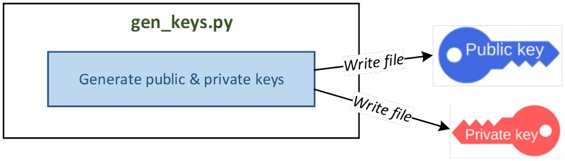
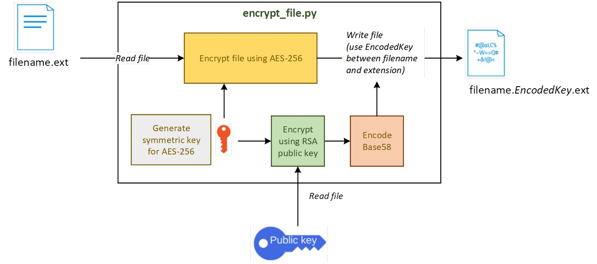
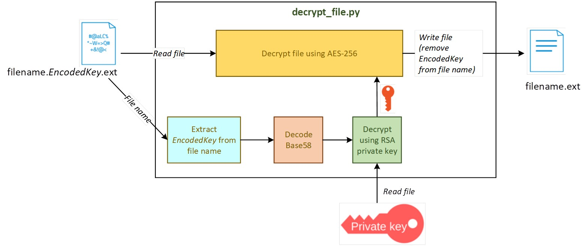
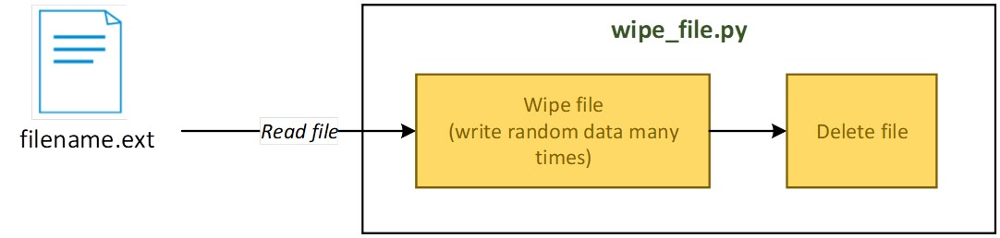
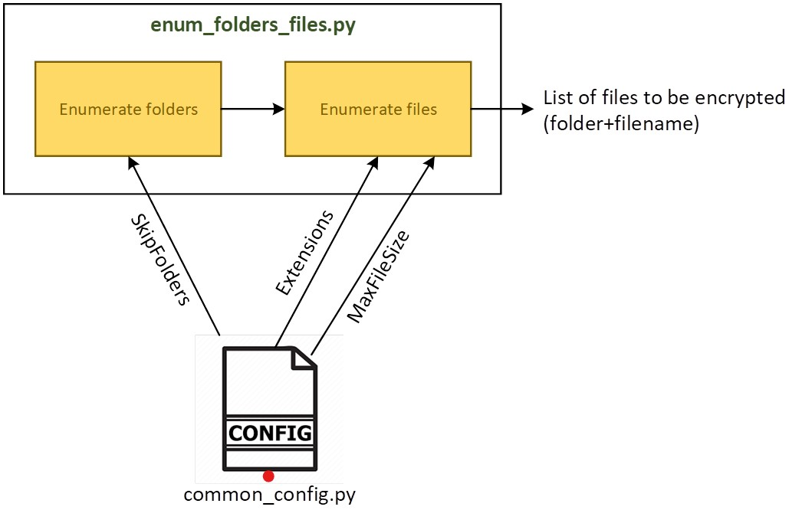

# Enigma2023_public
#### (Public version of Enigma2023 project.)

### What is Enigma2023? 
### It is a collection of Python scripts that simulate how ransomware behaves. 
#### I've created this project for educational purposes in the field of cybersecurity. 
#### Additionally, my deep interest in understanding the mechanics behind ransomware has driven me to develop this repository.
#
# gen_keys.py

### Generates the public and private keys for the RSA asymmetric encryption algorithm.
# prerequisites
pip install rsa
# 
#### RSA Key Pair Generation Script
#### This script allows you to generate RSA key pairs with customizable key sizes 
#### (512,4096 or other value bits) and save them to specified files.

# Execution information
``` r
python gen_keys.py --generate-keys (generates keys with default values)
python gen_keys.py --generate-keys --key-value <key_size>
python gen_keys.py --generate-keys --public-key  public.pem  --private-key private.pem --key-value 512
```
Options:
``` r
  --generate-keys    Generate new RSA keys.
  --key-value        Key size in bits (512 or 4096). Default is 512.
  --public-key       Public key file path. Default is "public_key.pem".
  --private-key      Private key file path. Default is "private_key.pem".
```
#
#
# encrypt_file.py


The script encrypts the file given in the input.
### Dependencies
This script requires the following Python libraries:
- `os`
- `base58`
- `argparse`
- `rsa`
- `re`
- `cryptography`

Ensure that you have these dependencies installed in your Python environment.
# Execution information

``` r
  python encrypt_file.py example.txt
```
The encrypted file will be saved with a modified filename containing the encoded AES key, such as example.bl2Kt.txt
#
#
# decrypt_file.py

The script decrypts the file given in the input. 
The key for decryption will be taken from the file name.
### Dependencies
This script requires the following Python libraries:
- `os`
- `base58`
- `argparse`
- `rsa`
- `re`
- `cryptography`

Ensure that you have these dependencies installed in your Python environment.
# Execution information

``` r
  python decrypt_file.py example.NVr58o63HGwj7PaDRKs_Sbd_f6dKvJKM47o-NsK3coZTg2ErSdfa8C_k2KhSYVIKrBrfnrUpzrwZYzDDvpk4d.txt
```
The decrypted file will be saved as "example.txt"
#
#
# wipe_file.py

Description:
This Python script allows you to securely wipe and delete an existing file or folder by overwriting its content with random data multiple times.

# Usage:
Command-line Arguments:
filename: The path to the file you want to wipe and delete.
--rounds: (Optional) The number of overwrite rounds to perform (default is 3).

# Execution information

In this case file to be deleted must be in the same folder as the script:
``` r
python wipe_file.py file.txt
```
or wipe file from the path:
``` r
python wipe_file.py "C:\Users\Documents\example.txt"
python wipe_file.py "C:\Users\Documents\example.txt" --rounds 5
```
The script will first overwrite the file's content multiple times with random data and then delete the file or folder, making it challenging to recover the original content.

Note:
- Be cautious when using this script, especially with system-critical files or directories. Deleting system files or directories can cause problems with your operating system.
- Ensure you have the necessary permissions to delete the specified files or directories.
- Running the script as an administrator might be required in some cases.
#
#
# 
# enum_folders_files.py

This script allows you to enumerate folders and files in a specified directory while providing configuration options via the 'common_config.py' module.
Example usage:
- To enumerate a directory:
``` r
python enum_folders_files.py
```
in next step paste path to folder you want to enumerate:
Enter the directory path to enumerate (e.g., /path/to/directory):
``` r
C:\Users\Test
```
- Customize the 'common_config.py' module to configure the script according to your requirements.
- Always make sure you have the necessary permissions to access the specified directory.
#
#